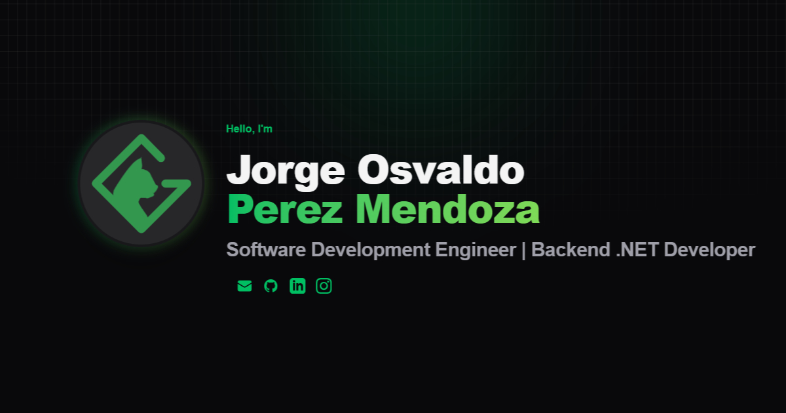

# Jorge Osvaldo Perez Mendoza - Portafolio y CV

[Español](./README_ES.md) | [English](./README.md)



¡Hola! Bienvenido al repositorio de mi portafolio web interactivo y Currículum Vitae. Soy **Ingeniero en Desarrollo de Software**, especializado en crear soluciones web innovadoras y robustas (Backend, Full Stack Web) promoviendo la mejora continua y la calidad del código.

## 📄 Descarga mi Currículum

Puedes encontrar un desglose detallado de mi experiencia laboral, mis habilidades y formación académica en el siguiente documento:

👉 **[Descargar CV en PDF (Inglés)](./CV%20Jorge%20Osvaldo%20Perez%20Mendoza%20EN.pdf)**

---

## 🌐 Sobre este Proyecto

Este proyecto es el código fuente de mi sitio web personal, diseñado para ser rápido, accesible y optimizado para motores de búsqueda (SEO). Está construido con una arquitectura moderna de generación de sitios estáticos para garantizar el mejor tiempo de respuesta posible.

### ✨ Características

- **Internacionalización (i18n):** Soporte bilingüe (Inglés y Español) con una sola plantilla por ruta y diccionarios de traducción por idioma (agregar un idioma consiste en añadir un diccionario y registrar el locale), además de enlaces hreflang alternos en las páginas y el sitemap.
- **Optimización de Buscadores (SEO):** Implementación integral con Open Graph, Sitemap dinámico y Twitter Cards para una alta visibilidad al compartirse.
- **Diseño Moderno:** Interfaz responsiva y amigable (Glassmorphism, gradientes fluidos y transiciones suaves).

### 🛠️ Tecnologías Principales

- **[Astro](https://astro.build/)**: Framework web optimizado para velocidad y entrega de contenido.
- **[Tailwind CSS 4](https://tailwindcss.com/)**: Estilos con clases de utilidad mediante el plugin `@tailwindcss/vite`. Los tokens de diseño (colores y tipografías) viven en `src/styles/global.css`, y solo las clases en uso terminan en el CSS final.
- **[@astrojs/sitemap](https://docs.astro.build/en/guides/integrations-guide/sitemap/)**: Genera el sitemap en tiempo de compilación.
- **[Firebase Hosting](https://firebase.google.com/docs/hosting) + GitHub Actions**: Cada pull request recibe un despliegue de vista previa, y cada merge a `main` despliega a producción.

---

## 🚀 Instalación y Ejecución Local

Si deseas correr este proyecto de manera local, necesitas Node.js `>= 22.12.0`. Sigue estas instrucciones:

1. Clona el repositorio:

   ```bash
   git clone https://github.com/furiduri/cv.git
   cd cv
   ```

2. Instala las dependencias:

   ```bash
   npm install
   ```

3. Ejecuta el servidor de desarrollo local:
   ```bash
   npm run dev
   ```

La landing de GCatcode estará disponible por defecto en `http://localhost:4321/` (Español, el idioma predeterminado) y `http://localhost:4321/en/` (Inglés); el CV en `/cv/` y `/en/cv/`; los términos y el aviso de privacidad en `/terminos/` y `/privacidad/` (y sus versiones en `/en/`).

## 📬 Contacto

Si deseas platicar sobre tecnología, oportunidades laborales, o mi afición por los Juegos de Mesa, ¡no dudes en contactarme!

- **Email:** contacto@gcatcode.com
- **Sitio Web en Vivo:** [cv.gcatcode.com](https://cv.gcatcode.com)
